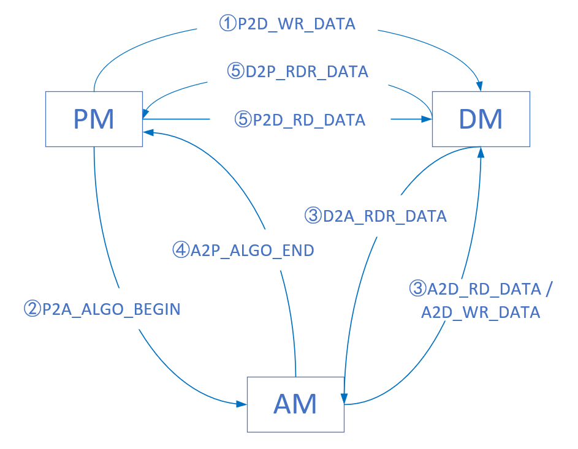
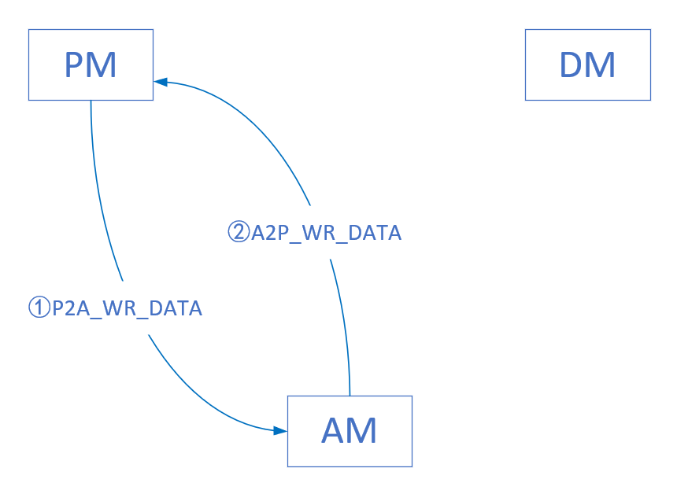
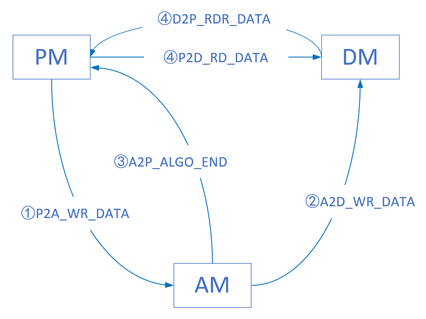
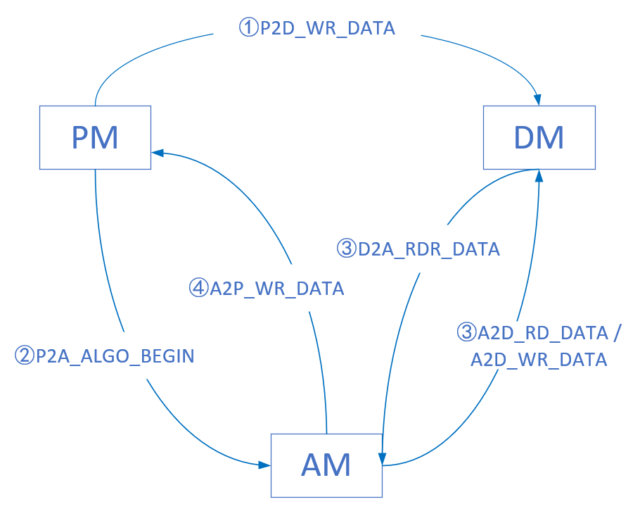

# 数据帧分类及功能说明

### 一、名称约定

#### 1.1、模块名称

针对 FPGA 中通信的三个模块，对模块名称进行缩写约定：

- PCIe 模块  —— PM。

- DDR4 模块 —— DM。

- 算法模块 —— AM。

#### 1.2、算法模式

根据 AM 是否通过 DM 进行数据缓存，将算法分为两种模式：

- DDR-usage，使用 DDR。
- DDR-bypass，旁路 DDR。

#### 1.3、数据分类

根据数据的来源及作用，将数据分为三类：

- 源数据，从 PM 传进来的原始数据。
- 中间数据，AM 计算产生的中间数据，通常需要在 DM 中缓存。
- 结果数据，AM 计算的结果，可由 AM 直接发给 PM，也可以经过 DM 缓存后发给 PM。

### 二、数据帧汇总

写数据帧直接带数据，读数据帧不带数据，由相应的读响应帧携带返回数据。

| 序号&nbsp; | 帧名称         | 类型&emsp;&emsp; | 操作                                                         | 含数据&emsp; | 含地址&emsp; |
| --------------------------------------------------- | -------------- | --------------------------------------------------------- | ------------------------------------------------------------ | ----------------------------------------------------- | ----------------------------------------------------- |
| 1                                                   | P2A_WR_REG     | 数据帧                                                    | PM 写入 AM 的用户寄存器。应用程序写入 AM 用户寄存器（预留功能）。 | 是                                                    | 是                                                    |
| 2                                                   | P2A_RD_REG     | 请求帧                                                    | PM 读取 AM 的用户寄存器。用于调度系统或上层应用读取本机当前状态，包括但不限于：整机状态，作业状态，烧录的程序版本。此帧不含数据。 | 否                                                    | 是                                                    |
| 3                                                   | A2P_RDR_REG    | 响应帧/数据帧                                             | AM 向 PM 返回用户寄存器的内容，是 P2A_RD_REG 的响应帧，携带读取的数据，不需要地址。 | 是                                                    | 否                                                    |
| 4                                                   | P2A_WR_DATA    | 数据帧                                                    | PM 向 AM 写入源数据，AM 收到即开始计算。                     | 是                                                    | 否                                                    |
| 5                                                   | A2P_WR_DATA    | 数据帧                                                    | AM 将计算结果直接发回 PM，不经过 DM 缓存。                   | 是                                                    | 否                                                    |
| 6                                                   | P2D_WR_DATA    | 数据帧                                                    | PM 向 DM 写入源数据，以供 AM 使用。地址是 DM 缓存数据的起始地址。 | 是                                                    | 是                                                    |
| 7                                                   | P2D_RD_DATA    | 请求帧                                                    | PM 从 DM 读出结果数据，是 AM 计算的结果。地址从命令帧 A2P_ALGO_END 中获得。 | 否                                                    | 是                                                    |
| 8                                                   | D2P_RDR_DATA   | 响应帧/数据帧                                             | DM 向 PM 返回请求的数据，是 P2D_RD_DATA 的响应帧。不需要地址。 | 是                                                    | 否                                                    |
| 9                                                   | P2A_ALGO_BEGIN | 命令帧                                                    | PM 通知 AM，源数据已缓存至 DM，可以开始计算。地址是 DM 的地址。 | 否                                                    | 是                                                    |
| 10                                                  | A2P_ALGO_END   | 命令帧                                                    | AM 通知 PM，结果数据已缓存至 DM，可以开始读取。地址是 DM 的地址。 | 否                                                    | 是                                                    |
| 11                                                  | A2D_WR_DATA    | 数据帧                                                    | AM 向 DM 写入数据，可以是中间数据，也可以是结果数据。地址是 DM 的地址。 | 是                                                    | 是                                                    |
| 12                                                  | A2D_RD_DATA    | 请求帧                                                    | AM 从 DM 读出数据，可以是中间数据，也可以是源数据。地址是 DM 的地址。 | 否                                                    | 是                                                    |
| 13                                                  | D2A_RDR_DATA   | 响应帧/数据帧                                             | DM 向 AM 返回请求的数据，是 A2D_RD_DATA 的响应帧。不需要地址。 | 是                                                    | 否                                                    |

### 三、数据帧按模块分类

#### 3.1、AM 帧

##### 3.1.1、AM 接收帧

AM 收到的帧共有以下几种（需要帧解析）：

- P2A_RD_REG，PM 读取 AM 的用户寄存器。用于读取本机当前状态，包括但不限于：整机状态，作业状态，烧录的程序版本。此帧不含数据。

- P2A_WR_REG，PM 写入 AM 的用户寄存器。用于存储上层应用程序或调度程序通知的信息。

- P2A_WR_DATA，PM 直接写入源数据到 AM。不经过 DM 缓存，AM 接收流式数据后直接开始计算。

- P2A_ALGO_BEGIN，PM 通知 AM 计算开始。PM 先把源数据缓存到 DM 中，然后通知 AM 开始计算，AM 根据给定的地址和长度从 DM 读取数据。

- D2A_RDR_DATA，DM 向 AM 返回读取的数据。

    

##### 3.1.2、AM 发送帧

AM 发送的帧共有以下几种（需要组帧）：

- A2P_RDR_REG，AM 向 PM 返回用户寄存器的数据。

- A2P_WR_DATA，AM 将计算结果直接发回 PM，不经过 DM 缓存。
- A2P_ALGO_END，AM 通知 PM 计算结束。将完整的计算结果写入 DM 后，通知 PM 计算结束。
- A2D_WR_DATA，AM 缓存数据到 DM。用于将计算结果写入 DM，或计算的中间数据缓存到 DM 中。
- A2D_RD_DATA，AM 读取 DM 的数据。此帧不含数据，只是请求帧。

#### 3.2、PM 帧

##### 3.2.1、PM 接收帧

PM 收到的帧共有以下几种（需要帧解析）：

- A2P_RDR_REG，AM 向 PM 返回用户寄存器的内容，是 P2A_RD_REG 的响应帧，携带读取的数据，不需要地址。
- A2P_WR_DATA，AM 将计算结果直接发回 PM，不经过 DM 缓存。
- D2P_RDR_DATA，DM 向 PM 返回请求的数据，是 P2D_RD_DATA 的响应帧。不需要地址。
- A2P_ALGO_END，AM 通知 PM，结果数据已缓存至 DM，可以开始读取。地址是 DM 的地址。

##### 3.2.2、PM 发送帧

PM 发送的帧共有以下几种（需要组帧）：

- P2A_WR_REG，PM 写入 AM 的用户寄存器。用于存储上层应用程序或调度程序通知的信息。
- P2A_RD_REG，PM 读取 AM 的用户寄存器。用于读取本机当前状态，包括但不限于：整机状态，作业状态，烧录的程序版本。此帧不含数据。
- P2D_WR_DATA，PM 写入源数据到 DM。PM 先将全部源缓存至 DM，然后通知 AM 从 DM 取数计算。
- P2D_RD_DATA，PM 从 DM 读出结果数据。此帧不含数据，只是请求帧。
- P2A_WR_DATA，PM 直接写入源数据到 AM。不经过 DM 缓存，AM 接收流式数据后直接开始计算。
- P2A_ALGO_BEGIN，PM 通知 AM 计算开始。PM 先把源缓存到 DM 中，然后通知 AM 开始计算，AM 根据给定的地址和长度从 DM 读取数据。

#### 3.3、DM 帧

##### 3.3.1、DM 接收帧

DM 收到的帧共有以下几种（需要帧解析）：

- P2D_WR_DATA，PM 向 DM 写入源数据，以供 AM 使用。地址是 DM 缓存数据的起始地址。
- P2D_RD_DATA，PM 从 DM 读出结果数据。此帧不含数据，只是请求帧。
- A2D_WR_DATA，AM 缓存数据到 DM。用于将计算结果写入 DM，或计算的中间数据缓存到 DM 中。
- A2D_RD_DATA，AM 读取 DM 的数据。此帧不含数据，只是请求帧。

##### 3.3.2、DM 发送帧

DM 发送的帧共有以下几种（需要组帧）：

- D2P_RDR_DATA，DM 向 PM 返回请求的结果数据，是 P2D_RD_DATA 的响应帧。
- D2A_RDR_DATA，DM 向 AM 返回请求的数据，是 A2D_RD_DATA 的响应帧。

### 四、算法模式详细设计

由于后续算法应用的场景和需求多种多样，所以根据输入和输出阶段对 DDR 的不同需求，算法模式再细分为四种。具体到一个应用中，只涉及其中一种，且需要硬件电路与应用程序配合。以下四种分类只涉及数据搬运流程，不涉及 PM 对 AM 用户寄存器的读写。

#### 4.1、全 DDR-usage

PM 先缓存源数据到 DM，然后通知 AM 开始工作，AM 将计算结果存入 DM 后通知 PM，PM 从 DM 中读取结果。

应用场景：AM 无法流式处理源数据，需要利用 DM 作为缓存，多次读写中间数据，并将结果数据写回 DM 后再由 PM 读出。

具体流程如下图（图中忽略路由模块）：

#### 4.2、全 DDR-bypass

PM 直接将源数据流入 AM 中，AM 的计算结果也同样流出到 PM 中，不经过 DM 缓存。

应用场景：算法模块可以流式处理，无需 DM 缓存输入值或计算的中间结果，且结果数据量大小固定。例如，对输入数据进行 +1 操作，结果数据量等于源数据量。又或者，直方图统计应用，结果数据量的大小很明确，等于像素的范围值（如 0-255、0-65535 等）。

具体流程如下图（图中忽略路由模块）：

#### 4.3、输入 DDR-bypass，输出 DDR-usage

PM 直接将源数据流入 AM 中，AM 将结果缓存到 DM 中，最后统一输出。

应用场景：算法模块可以流式处理，但结果数据量大小未知，需要先缓存到 DM 中，最后统一输出。例如，筛选特定模式的数据，结果数据量大小未知。

具体流程如下图（图中忽略路由模块）：

#### 4.4、输入 DDR-usage，输出 DDR-bypass

PM 先将源数据缓存至 DM 中，然后通知 AM 可以开始计算，AM 从 DM 中读取源数据，边计算边将结果数据写入 PM，不经过 DM 缓存。

应用场景：AM 需要多次读写 DM 存放中间数据，但输出结果大小是已知的，或计算过程中可以按已知大小分段输出，不需要 DM 缓存。

具体流程如下图（图中忽略路由模块）：

### 待讨论

1、写入数据是否需要响应帧确保数据正确，还是默认正确写入。

2、AM 的主时钟应该直接使用 AXIS_CLK，还是使用外部输入的 25MHz 时钟的倍频时钟。
